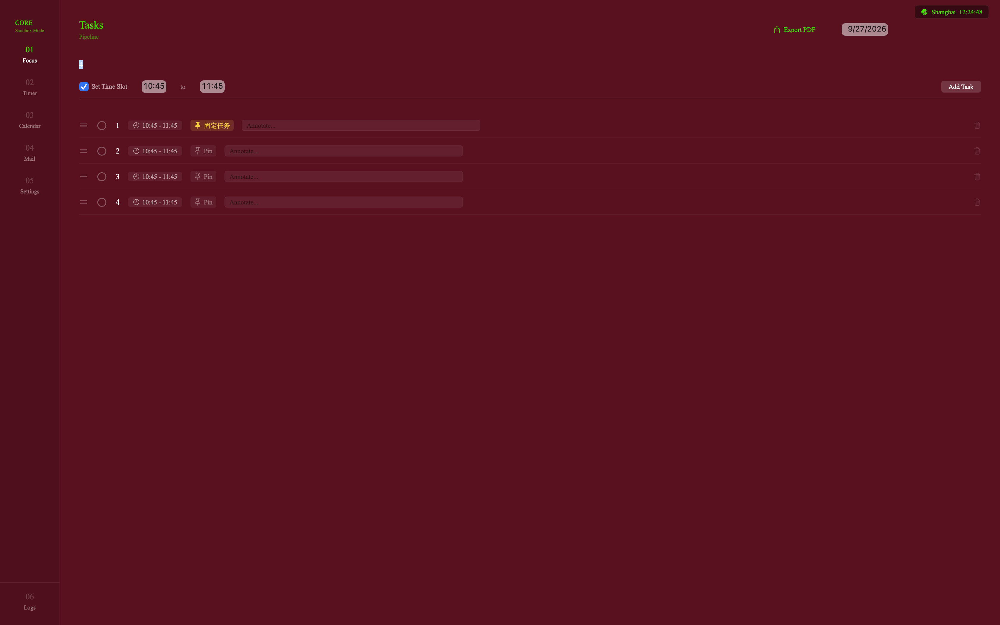
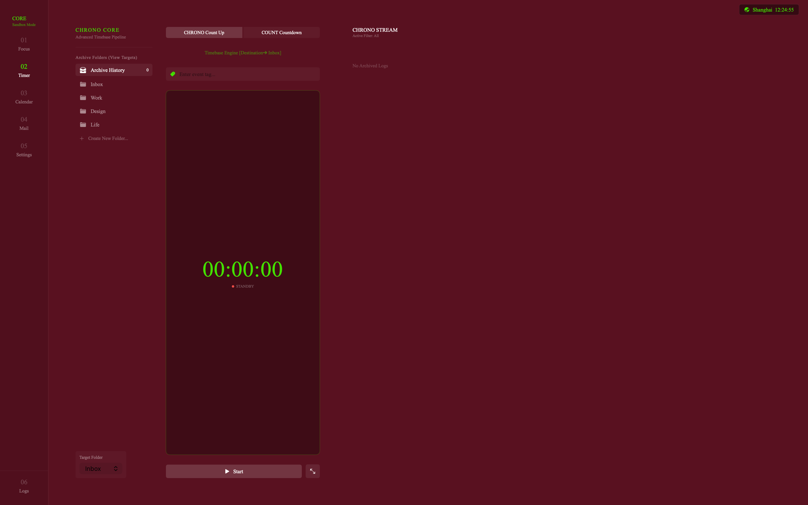
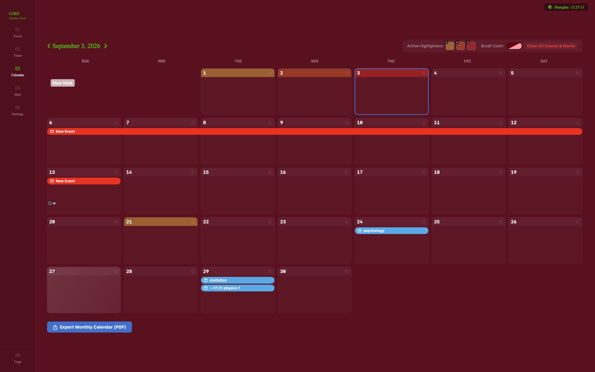
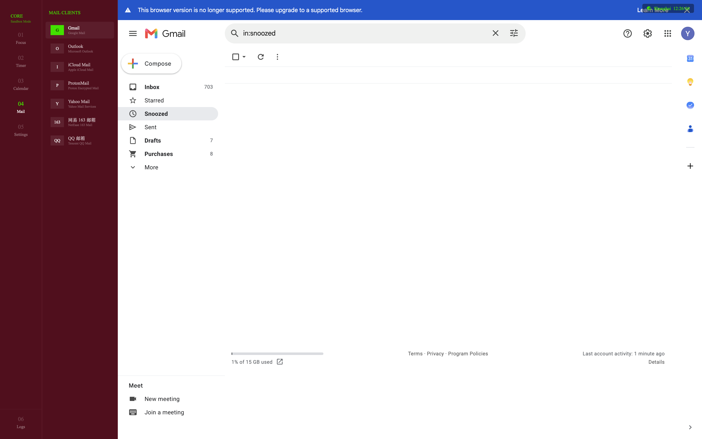
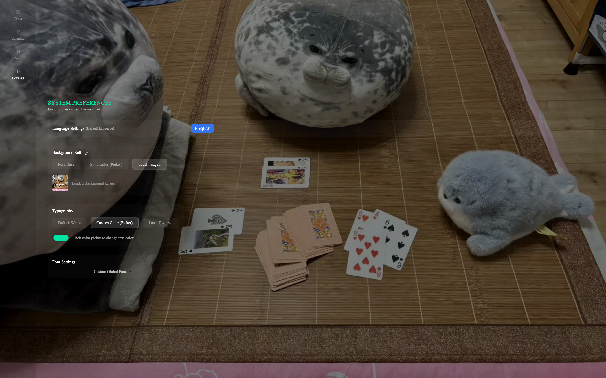
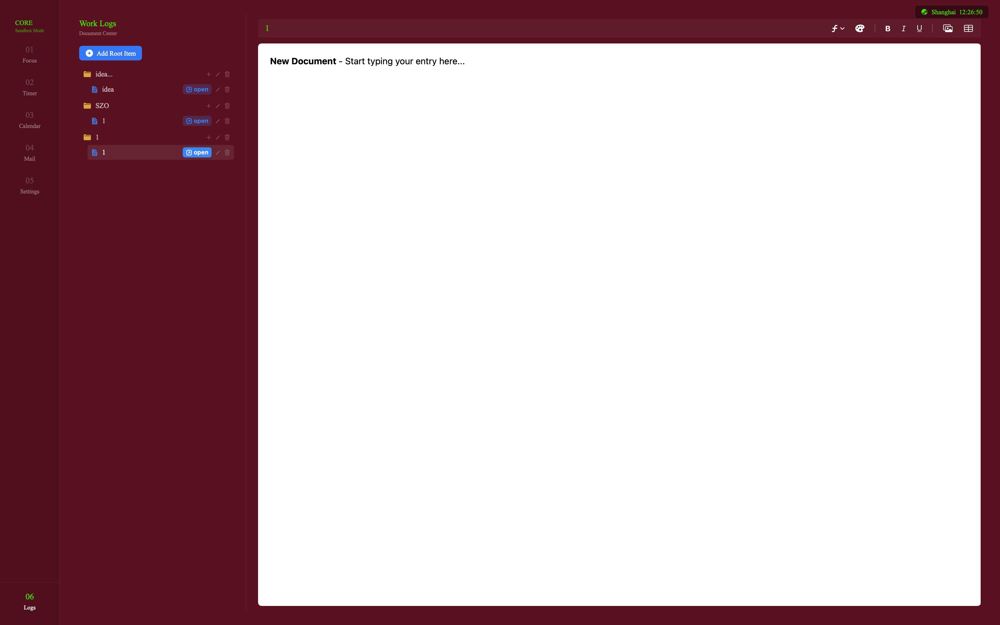
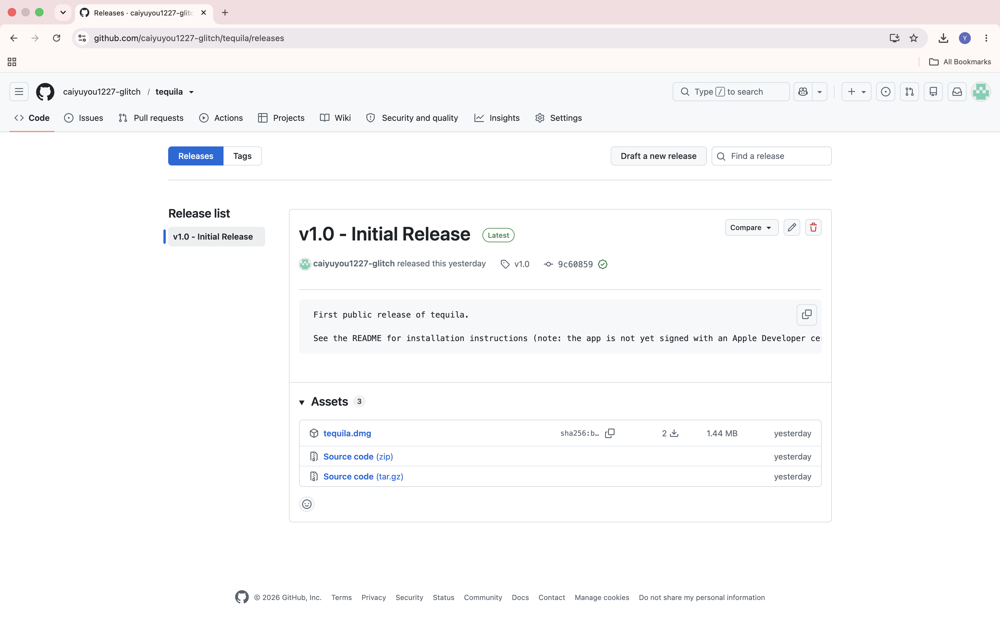
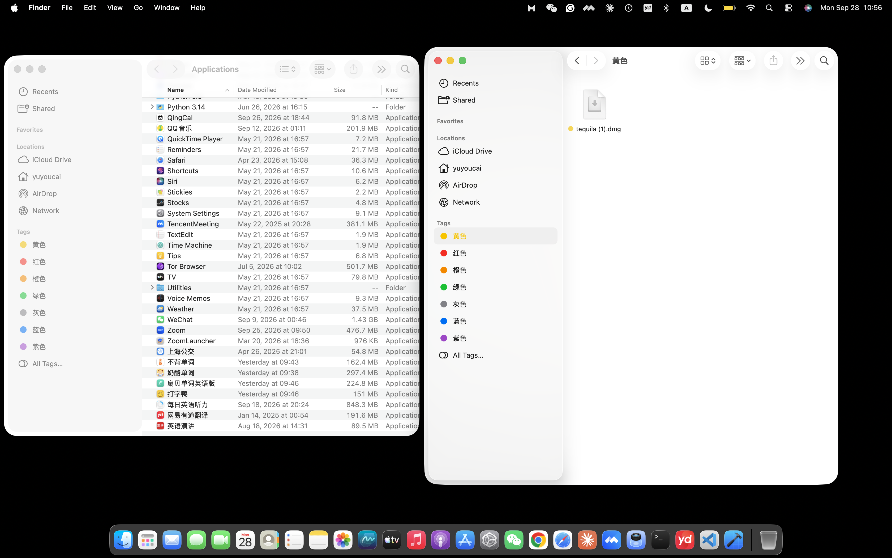
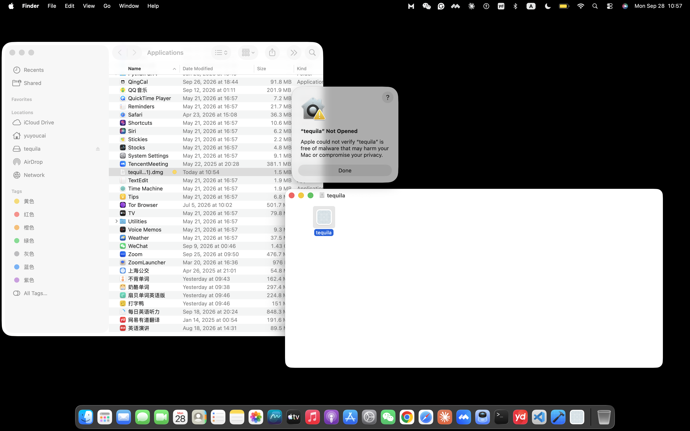
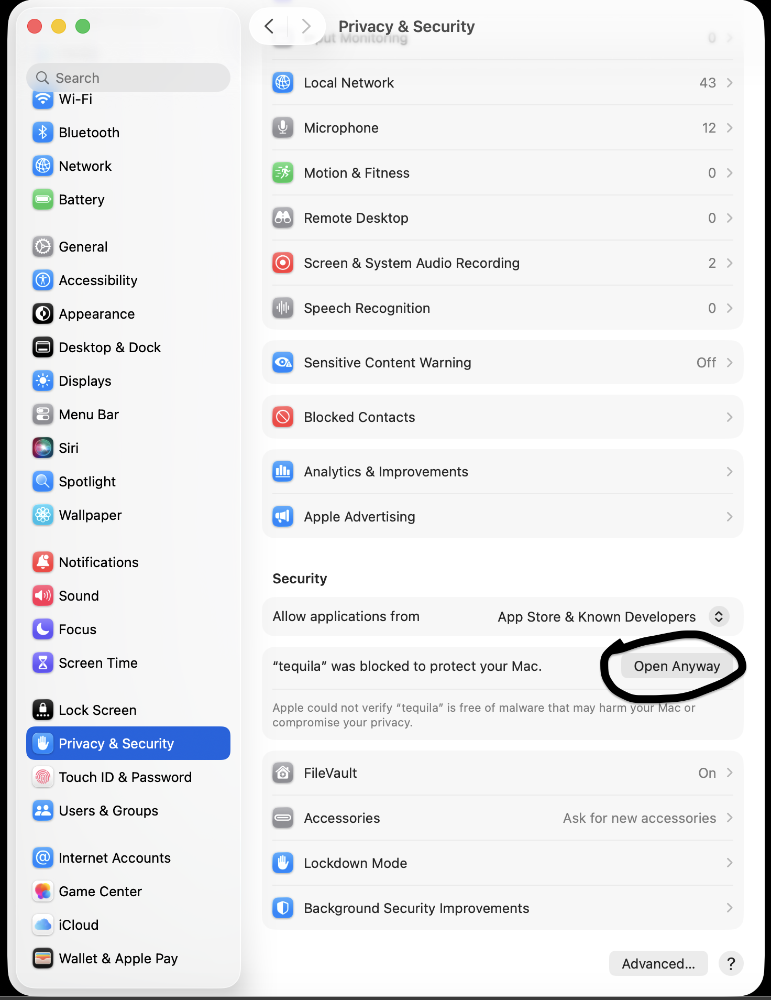

# tequila

**A productivity app built where professional utility meets aesthetic design.**

Most productivity tools force a trade-off: either powerful but ugly, or pretty but shallow. tequila is built to close that gap — six focused modules, a fully customizable look, and a workflow designed around how creative and professional work actually happens.

## Features

### 🎯 Focus
Plan tasks for today or any date. Assign time blocks, and tasks auto-sort chronologically. Export any day's task list.

### ⏱ Timer
Unlimited count-up and countdown timers. Label what each session is for, organize sessions into custom folders for tracking time across different projects.

### 📅 Calendar
Browse any month. Mark dates with a highlighter tool — overlapping highlights blend colors, so overlapping schedules are visible at a glance. Drag directly on a date to create a schedule bar, customize time and font colors, and export the full month as a PDF in either bar or circle style.

### 📬 Mail
One unified inbox for Gmail, Outlook, iCloud Mail, ProtonMail, Yahoo Mail, 163, and QQ Mail — read and reply without switching between apps during focused work.

### ⚙️ Settings
Customize background and font with solid colors or uploaded images, and choose your typeface. Default language is English, with support for adding more languages planned — the app is built so language is never a barrier to using it fully.

### 📝 Logs
A workspace for notes on ongoing work — insert images and tables, organize entries into folders and files.

Each module includes an auto-detecting, freely movable location indicator that updates based on your region settings.

## Installation

**Step 1 — Download.** Go to the [Releases](../../releases) page and download `tequila.dmg`.

**Step 2 — Install.** Open the dmg and drag tequila into your Applications folder.

**Step 3 — First launch.** Open tequila from Applications. macOS will show a message saying Apple could not verify tequila is free of malware. This appears because the app has not yet been notarized by Apple. The full source code is in this repository, and you can also build it yourself in Xcode (open `tequila.xcodeproj`, choose "My Mac", press Run).

**Step 4 — Open it anyway.** Click Done, open **System Settings → Privacy & Security**, scroll down to the message about tequila, click **Open Anyway**, and enter your password if asked. Then open tequila again.

**Alternative:** if you don't see the Open Anyway button, open Terminal, run `xattr -cr /Applications/tequila.app`, then open tequila again.

## Tech Stack

Built natively in Swift for macOS.

## Why I built this

I come from a background in fashion design, fashion management, and 2D/3D visual production — not traditional software engineering. I built tequila because I couldn't find a productivity tool that respected both function and design: the options I found were either too simplistic or genuinely inconvenient to use day to day. This started as something I built for myself, but I'd like to share it more widely.

I'm a high school student building this independently, and I'd genuinely welcome feedback, bug reports, or feature ideas — [open an issue](../../issues) anytime.

## Feedback

If tequila is useful to you, or if something's broken or missing, please [open an issue](../../issues). Every report helps make this better.
